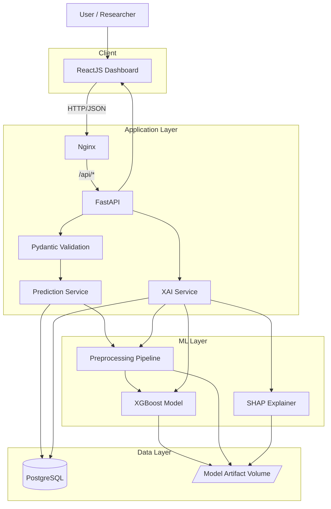
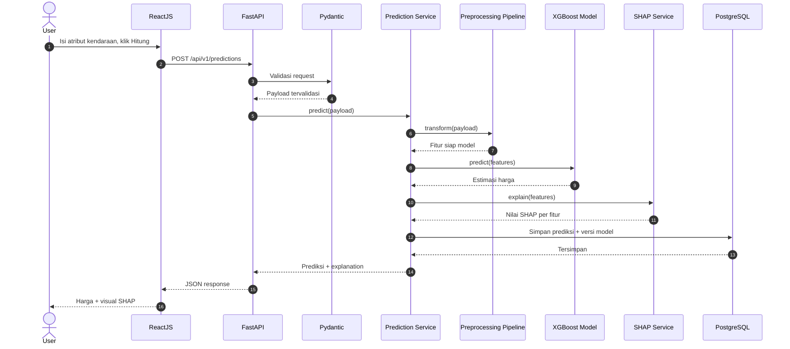

# XAI Car Price (CP) — Prediksi Harga Mobil Bekas dengan XGBoost + SHAP

Implementasi dan evaluasi model XGBoost untuk prediksi harga mobil bekas dengan
Explainable Artificial Intelligence menggunakan SHAP. Proof-of-concept end-to-end:
dataset dan metadata model di PostgreSQL, preprocessing reproducible, training
XGBoost, evaluasi MAE/RMSE/MAPE/R2, SHAP global/lokal, REST API prediksi +
explanation, dashboard ReactJS, seluruh stack containerized dengan Docker.

## Daftar isi

1. [Konsep dan ruang lingkup](#1-konsep-dan-ruang-lingkup)
2. [Arsitektur](#2-arsitektur)
3. [Dataset dan keputusan data](#3-dataset-dan-keputusan-data)
4. [Pipeline ML dan artifact model](#4-pipeline-ml-dan-artifact-model)
5. [Backend (FastAPI)](#5-backend-fastapi)
6. [Frontend (ReactJS)](#6-frontend-reactjs)
7. [Database (PostgreSQL + pgAdmin)](#7-database-postgresql--pgadmin)
8. [Konfigurasi dan password](#8-konfigurasi-dan-password)
9. [Deploy dan menjalankan](#9-deploy-dan-menjalankan)
10. [Testing](#10-testing)
11. [Struktur repo](#11-struktur-repo)
12. [Kriteria penerimaan](#12-kriteria-penerimaan)
13. [Keterbatasan dan lanjutan TA](#13-keterbatasan-dan-lanjutan-ta)

## 1. Konsep dan ruang lingkup

Setiap prediksi harus bisa menjawab dua pertanyaan: **berapa estimasinya** dan
**mengapa sebesar itu**. Prinsip yang dipegang:

- **Satu pipeline preprocessing** dipakai saat training dan inference. Model tidak
  pernah melihat data mentah.
- **Model versioning**: setiap prediksi menyimpan `model_version`, jadi hasilnya
  selalu bisa ditelusuri ke artifact dan metrik yang menghasilkannya.
- **SHAP sebagai bagian dari inference**, bukan analisis offline. Backend menghitung
  kontribusi tiap fitur di dalam request flow `Input -> Prediction -> Explanation -> UI`,
  agar model tidak pernah dikirim ke browser.
- **API-first**: ReactJS hanya presentation layer. Semua inference lewat FastAPI,
  route handler tidak mengakses database langsung (service/repository layer).

Di luar scope CP: benchmarking multi-model (RF/LightGBM), LIME, auto-retraining
MLOps, deteksi drift, rekomendasi MCDM, scraping real-time, auth kompleks.

## 2. Arsitektur



Alur prediksi + penjelasan:



Deploy (satu perintah, sesuai `docker-compose.yml`):

```text
Browser
  |
  v
http://localhost            (nginx :80)
  |-- /        -> frontend (React build + nginx)
  |-- /api/    -> backend  (FastAPI + Uvicorn :8000)
  |-- :5050    -> pgAdmin  (langsung, tanpa login)
                    |
backend -> postgres :5432 (tidak diekspos ke host; volume postgres_data)
backend -> artifact model (bind-mount read-only)
```

| Service  | Image / Build        | Akses host | Peran                          |
|----------|----------------------|------------|--------------------------------|
| nginx    | `nginx:alpine`       | `:80`      | Reverse proxy `/` dan `/api/`  |
| frontend | build `./frontend`   | via nginx  | Dashboard ReactJS              |
| backend  | build `./backend`    | via nginx  | FastAPI + XGBoost + SHAP       |
| postgres | `postgres:16-alpine` | -          | Database + metadata + log      |
| pgadmin  | `dpage/pgadmin4:9`   | `:5050`    | Administrasi database          |

## 3. Dataset dan keputusan data

`dataset.csv`: 22.679 baris, 14 kolom, target `price`, tanpa missing value.

| Jenis kolom | Kolom |
|---|---|
| Kategorikal | `brand` (51), `brand_type` (2.002), `machine_type`, `location` (22), `listing__type` |
| Numerik | `year` (1975-2025), `KM_1`, `KM_2` |
| Teks mentah | `item`, `ellipsize`, `listing__excerpt` |

Keputusan penelitian (diimplementasikan di `ml/scripts/`):

- Eksperimen utama hanya listing `Bekas` + `Used` (21.553 baris). `Baru` dibuang.
- `Unnamed: 0` = index, bukan fitur.
- `KM_1` dan `KM_2` berkorelasi 0,999 (redundan), dipakai satu: `km_1`.
- Kolom teks mentah tidak dipakai di baseline (scope + cegah leakage).
- `brand_type` high-cardinality di-encode **di dalam pipeline** (tanpa target leakage).

## 4. Pipeline ML dan artifact model

```text
Raw CSV -> Filter Used/Bekas -> Quality Check -> Split 80/20 (seed 42)
  -> ColumnTransformer (fit hanya di train) -> XGBoost -> Evaluasi -> Artifact
```

Fitur: `year`, `km_1` (numerik passthrough), `brand`/`machine_type`/`location`
(OneHot, unknown diabaikan), `brand_type` (Ordinal, unknown = -1).

Model aktif `xgb-v1` (`artifacts/models/xgboost/xgb-v1/`), metrik test:

| MAE | RMSE | MAPE | R2 |
|---|---|---|---|
| 45.826.008 | 76.505.309 | 16,42% | 0,8688 |

Konvensi artifact per versi (`model.json`, `preprocessing.joblib`,
`feature_schema.json`, `metrics.json`, `training_config.json`, `shap_config.json`):
satu `model_version` mengikat model + preprocessing + skema + metrik + konfigurasi
SHAP, sehingga inference selalu reproducible. Training:

```bash
python ml/scripts/profile_dataset.py   # profiling + filter -> data/processed/
python ml/scripts/train_baseline.py    # latih + evaluasi + simpan artifact
```

Penjelasan lokal memakai TreeSHAP eksak native XGBoost
(`Booster.predict(pred_contribs=True)`), diagregasi kembali ke 6 fitur asli.
Terverifikasi aditivitasnya: `base_value + sum(shap) = prediksi` (residu Rp88
akibat pembulatan float32). Tidak butuh lib `shap` saat inference.

## 5. Backend (FastAPI)

Base URL `/api/v1`. Model dan explainer dimuat **sekali** saat startup (lifespan),
tidak reload per request. Inference dibatasi timeout (`INFERENCE_TIMEOUT_S`,
respons 504 bila lewat). Startup otomatis membuat tabel dan seed metadata
dataset + versi model + metrik.

| Method | Endpoint | Keterangan |
|---|---|---|
| GET | `/health` | `{"status": "ok", "model_version": "xgb-v1"}` (503 bila model belum termuat) |
| POST | `/predictions` | Prediksi + explanation, log ke PostgreSQL (best-effort) |
| GET | `/models/active` | Metadata model aktif + metrik per split |
| GET | `/predictions/{id}` | Detail input + prediksi + explanation |
| GET | `/stats/dataset` | Statistik database listings (total, harga, tahun, km, merek, lokasi, histogram; filter opsional `brand`, `location`, `machine_type`, `year_min`, `year_max`) |

Contoh request:

```json
{"brand": "Honda", "brand_type": "City 1.5 E Sedan", "machine_type": "Automatic",
 "location": "DKI Jakarta", "year": 2021, "km_1": 45000, "km_2": 45000}
```

Contoh response:

```json
{"prediction_id": "uuid", "model_version": "xgb-v1", "predicted_price": 258148416,
 "currency": "IDR",
 "explanation": {"base_value": 313370208,
   "features": [{"feature": "year", "value": 2021, "shap_value": 25150464}] } }
```

Validasi Pydantic: `1930 <= year <= 2026`, `0 <= km <= 1.000.000` (batas dari
distribusi data, dapat diubah via env `MIN_YEAR`/`MAX_YEAR`/`MAX_KM`), minimal
satu dari `km_1`/`km_2` terisi, kategori asing ditoleransi (tetap memprediksi).
Kode: `backend/app/{api,core,db,ml,repositories,schemas,services}`.

## 6. Frontend (ReactJS)

Halaman `Beranda` (penjelasan + metrik model live dari API), `Data` (dashboard
statistik database listings: tata letak lebar di desktop dan ringkas di mobile,
ringkasan, histogram harga, perbandingan transmisi, merek dan lokasi berdampingan,
histogram tahun penuh, semuanya dengan tooltip hover/sentuh/fokus dan
scroll-reveal), dan `Hitung estimasi`
(formulir -> kartu hasil -> grafik SHAP). Komponen sesuai blueprint: `VehicleForm`,
`PredictionCard`, `ShapWaterfall`, `ShapBarChart`, `LoadingState`, plus
`services/api.js`, `hooks/usePrediction.js`, `utils/formatCurrency.js`.

Aturan yang dipegang: styling Tailwind CSS (tema dari palet calm yang sama),
satu aplikasi dua shell via hook `useWindowSize` (batas 768px): desktop dengan
Sidebar statis, mobile dengan Hamburger Menu + Bottom Navigation Bar,
tanpa emoji (ikon SVG inline yang relevan), hasil disebut
**estimasi model** bukan harga pasti, opsi dropdown dari dataset asli (47 merek,
21 lokasi), semua angka dari API, state kosong/loading/error informatif (sebab +
aksi), responsif dan keyboard-only friendly (skip link, kontrol native, fokus
terlihat). API base via `VITE_API_URL`, default same-origin `/api/v1`.

## 7. Database (PostgreSQL + pgAdmin)

Lima tabel sesuai ERD: `datasets` (metadata dataset), `listings` (observasi mobil
bekas), `model_versions` (mini model registry, satu baris aktif), `model_metrics`
(metrik per split: test/validation), `predictions` (`input_payload` +
`shap_payload` sebagai JSONB untuk audit trail).

Seed metadata otomatis saat backend start. Tabel `listings` ikut di-seed otomatis
bila kosong dan file CSV tersedia (`SEED_CSV_PATH`, di compose ter-mount dari
`./data/processed`). Matikan dengan `SEED_ON_STARTUP=false`. Seed manual
penuh (dataset + listings + model + metrik):

```bash
# Postgres harus dapat dijangkau, mis. port-forward atau DATABASE_URL lokal
set DATABASE_URL=postgresql+psycopg://app@HOST:5432/carprice
python ml/scripts/seed_db.py
```

pgAdmin tanpa login di `http://localhost:5050`, server `carprice (local)` sudah
terdaftar otomatis.

## 8. Konfigurasi dan password

Semua endpoint, secret, dan parameter via environment (`.env`, contoh di
`.env.example`). Tidak ada hardcode di source code.

**Mode default = passwordless lokal** (cukup `docker compose up`):

- Postgres: `POSTGRES_HOST_AUTH_METHOD=trust`, tanpa password.
- pgAdmin: desktop mode tanpa layar login, server terdaftar via `servers.json`.

Bila butuh password (server bersama/produksi):

1. Isi `POSTGRES_PASSWORD=...` dan `POSTGRES_HOST_AUTH_METHOD=scram-sha-256`.
2. Samakan di `DATABASE_URL=postgresql+psycopg://app:<password>@postgres:5432/carprice`.
3. Kembalikan pgAdmin ke mode login (hapus `PGADMIN_CONFIG_SERVER_MODE`) dan
   daftarkan server manual (host `postgres`, user `app`, password sama).

Variabel utama: `DATABASE_URL`, `POSTGRES_DB/USER/PASSWORD/HOST_AUTH_METHOD`,
`PGADMIN_PORT/DEFAULT_EMAIL`, `MODEL_DIR`, `MODEL_VERSION`,
`CORS_ORIGINS`, `INFERENCE_TIMEOUT_S`, `RANDOM_SEED`, `DATASET_PATH`,
`SEED_ON_STARTUP`, `SEED_CSV_PATH`,
`VITE_API_URL`, `VITE_API_TIMEOUT_MS`.

## 9. Deploy dan menjalankan

Prasyarat: Docker + Docker Compose v2.

```bash
cp .env.example .env          # opsional, default sudah passwordless
docker compose up -d --build  # bangun + jalankan semua service
docker compose ps             # pastikan semua Up/healthy
```

Akses:

| Layanan | URL |
|---|---|
| Dashboard | http://localhost/ |
| Hitung estimasi | http://localhost/#/prediksi |
| API health | http://localhost/api/v1/health |
| pgAdmin | http://localhost:5050 |

Uji cepat end-to-end:

```bash
curl http://localhost/api/v1/health
curl -X POST http://localhost/api/v1/predictions -H "Content-Type: application/json" -d "{\"brand\":\"Honda\",\"brand_type\":\"City 1.5 E Sedan\",\"machine_type\":\"Automatic\",\"location\":\"DKI Jakarta\",\"year\":2021,\"km_1\":45000,\"km_2\":45000}"
```

Perintah umum: `docker compose logs -f backend`, `docker compose down`,
`docker compose down -v` (hapus juga data postgres dan pgAdmin).

Troubleshooting:

- `backend` restart terus: cek `docker compose logs backend`; pastikan folder
  `artifacts/models/xgboost/xgb-v1/` ada (di-mount read-only).
- `pgadmin` meminta login: pastikan `PGADMIN_CONFIG_SERVER_MODE=False` dan volume
  `servers.json` termount; hapus volume `pgadmin_data` bila config lama tersimpan.
- `postgres` menolak koneksi: tunggu healthcheck (`pg_isready`), cek
  `POSTGRES_HOST_AUTH_METHOD`.
- Build backend lama (>10 menit): wajar, instalasi `xgboost` + `shap` (+ lib sains)
  di image `python:3.11-slim`.

Pengembangan lokal tanpa Docker: backend `pip install -r backend/requirements.txt`
lalu `uvicorn app.main:app` dari `backend/` (set `DATABASE_URL` sqlite/Postgres
dan `MODEL_DIR` absolut); frontend `npm install && npm run dev` dari `frontend/`
(proxy `/api` ke `localhost:8000`).

## 10. Testing

- Phase 1: `profile_dataset.py` (filter 21.553 baris, korelasi 0,999) dan
  `train_baseline.py` (metrik di atas, artifact 6 file).
- Phase 2: `cd backend && python -m pytest tests -q` (6/6: health, prediksi valid,
  roundtrip GET, 422 numerik invalid, 422 tipe salah + 200 kategori asing,
  models/active + metrik).
- Phase 3: `npm run build`, unit `formatCurrency`, smoke API + `vite preview`,
  cek bundle (tanpa hardcode/emoji/em dash), kontras WCAG AA, Delivery Gate Antislop.
- Phase 4: `docker compose config` + build semua image + uji e2e di atas
  (React -> Nginx -> FastAPI -> XGBoost -> SHAP -> PostgreSQL).

## 11. Struktur repo

```text
frontend/            # ReactJS (src/components, pages, services, hooks, utils)
backend/             # FastAPI (app/api, core, db, ml, repositories, schemas, services)
ml/scripts/          # profile_dataset, train_baseline, seed_db
data/processed/      # hasil filter (regenerable, di-ignore git)
artifacts/models/    # artifact versioned xgb-v1
infra/nginx/         # reverse proxy utama
infra/pgadmin/       # servers.json praregistrasi
docker-compose.yml
.env.example
```

Urutan implementasi: Phase 1 data/ML -> Phase 2 backend -> Phase 3 frontend ->
Phase 4 containerization. Tanpa auto-retraining (offline/manual saja).

## 12. Kriteria penerimaan

- [x] Dataset dimuat dan divalidasi (21.553 Bekas/Used, 0 missing).
- [x] Preprocessing reproducible (satu pipeline train = inference).
- [x] XGBoost terlatih sebagai artifact versioned (`xgb-v1`).
- [x] Prediksi di test set + MAE/RMSE/MAPE/R2 terhitung.
- [x] SHAP lokal per prediksi (aditivitas terverifikasi; global mengikuti dari artifact + metrik).
- [x] Endpoint prediksi + explanation berjalan.
- [x] ReactJS kirim input, tampilkan harga + SHAP.
- [x] PostgreSQL simpan metadata dataset/model + log prediksi.
- [x] `docker compose up` menjalankan semua service.
- [x] `model_version` tertelusur dari respons prediksi.

## 13. Keterbatasan dan lanjutan TA

Keterbatasan CP: baseline satu model, lib `shap` tidak bisa build di Python 3.13
lokal (diverifikasi di image 3.11; inference memakai TreeSHAP native), seed
listings manual, tanpa auth/drift-monitoring.

Lanjutan TA yang disiapkan arsitektur: tambah `Authentication + User Management +
Dashboard analytics + Model monitoring` di sisi aplikatif; `Random Forest +
LightGBM + LIME + uji konsistensi explanation` di sisi riset. Service backend
tetap, perubahan di layer eksperimen dan model registry.
